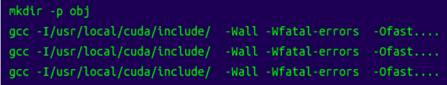
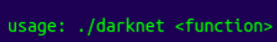
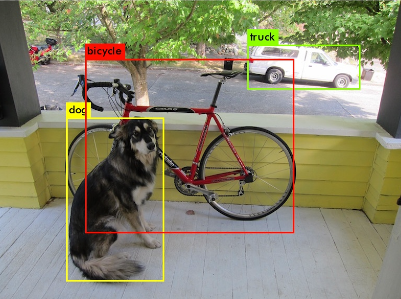
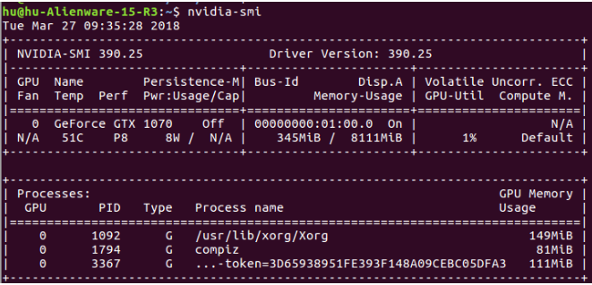
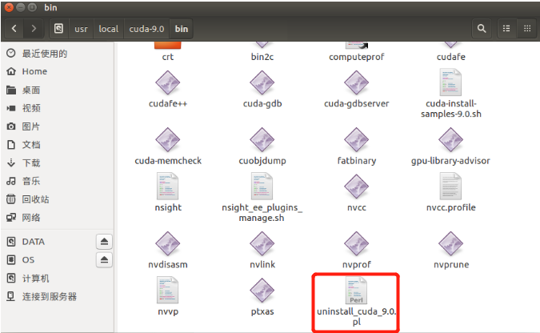
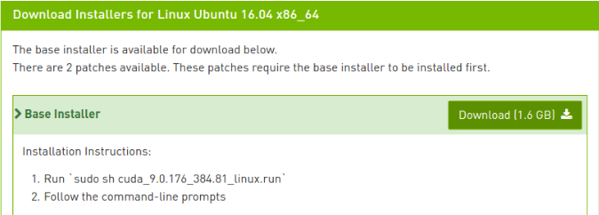
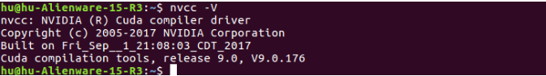
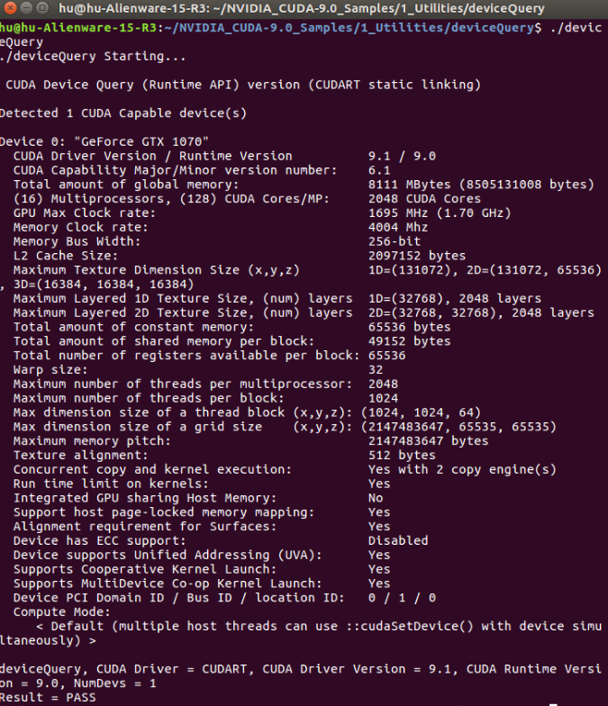

# Introduction

This project based on [darknet](https://github.com/pjreddie/darknet). I've accomplished the car detection function in video by using YOLO. Here is the [demo](https://www.youtube.com/edit?video_referrer=watch&video_id=DzNcvN6H0r4). The source code can be downloaded in [github](https://github.com/pjreddie/darknet) and this project is mainly about how to use CUDA to accomplish the fast car detection with YOLO.

# Guidance

## Basic YOLO (No GPU, No OpenCV)

Clone the [darknet](https://github.com/pjreddie/darknet) in Github:

    git clone https://github.com/pjreddie/darknet.git
	cd darknet
	make

	./darknet

Now download the weight file from [here](https://pjreddie.com/media/files/yolov3.weights). In this project, I select YOLO-V3 model as the pretrained model.

Then run the detector to test the object detection on an image:

	./darknet detect cfg/yolov3.cfg yolov3.weights data/dog.jpg

## YOLO (With GPU and OpenCV) to Process Video

### Deep Learning Environment

#### 1. Install Nvidia Driver

Make sure the version of Nvidia driver from the [office webiste](http://www.nvidia.com/Download/index.aspx?lang=cn), then obey the steps released in Part2.4--Nvidia Driver  in [my blog](https://blog.csdn.net/huuuuusy/article/details/78008195).

	nvidia-smi 

#### 2. Install CUDA

To make sure the CUDA vision is currect, it's better to uninstall the old vision and install the new version.

	sudo /usr/local/cuda-9.0/bin/uninstall_cuda_9.0.pl

Then download the CUDA from [office website](https://developer.nvidia.com/cuda-downloads
). I select CUDA 9.0.

***Attention: the Nvidia driver with CUDA(384.81) is older than the version we've installed in step1(390.25), thus do not accept to install Nvidia driver with cuda in the installatiion process.***

	sudo sh cuda_9.0.176_384.81_linux.run

After installation, type the following commands in terminal:

	sudo gedit /etc/profile

Add the following information in last line:

	export PATH=/usr/local/cuda-9.0/bin:$PATH  
	export LD_LIBRARY_PATH=/usr/local/cuda-9.0/lib64:$LD_LIBRARY_PATH

Save and type:

	sudo ldconfig

Then type commands in terminal:

	sudo gedit ~/.bashrc

Add the following information in last line as well:

	export PATH=/usr/local/cuda-9.0/bin:$PATH  
	export LD_LIBRARY_PATH=/usr/local/cuda-9.0/lib64:$LD_LIBRARY_PATH****

Then type commands in terminal:
	
	source ~/.bashrc

Now check in terminal:

	nvcc -V

Test an example:

	cd /NVIDIA_CUDA-9.0_Samples/1_Utilities/deviceQuery
	sudo make all
	./deviceQuery

#### 3. Install Cudnn

Download cudnn from [office website](https://developer.nvidia.com/cudnn).

Uncompress the file and open a terminal in the cuda folder.

	sudo cp lib64/* /usr/local/cuda/lib64/
	sudo cp include/* /usr/local/cuda/include/
	sudo chmod 777 /usr/local/cuda/lib64/
	sudo chmod 777 /usr/local/cuda/include/

***Avoiding the following step shows errors like cannot find libcudart, it is better to add 3 more commends here:***

	sudo cp /usr/local/cuda-9.0/lib64/libcudart.so.9.0 /usr/local/lib/libcudart.so.9.0 && sudo ldconfig
	sudo cp /usr/local/cuda-9.0/lib64/libcublas.so.9.0 /usr/local/lib/libcublas.so.9.0 && sudo ldconfig
	sudo cp /usr/local/cuda-9.0/lib64/libcurand.so.9.0 /usr/local/lib/libcurand.so.9.0 && sudo ldconfig

#### 4. Install Tensorflow

It is easy to install the GPU version tensorflow:

	conda create -n tensorflow
	source activate tensorflow
	pip install tensorflow-gpu

Now can test it by using:

	python
	import tensorflow as tf

### OpenCV

The darknet does not support OpenCV 3.4.1, thus I installed OpenCV 3.4.0 based on this [blog](https://blog.csdn.net/cocoaqin/article/details/78163171), just obey each step except the version. 

***It may need 2 hours to complie OpenCV in Ubuntu, and the final package is more than 6G(Please allocate enough space).***

### Test YOLO

Now open the Makefile in darknet folder, and change the configuration.

	GPU=1
	CUDNN=1
	OPENCV=1

	NVCC=/usr/local/cuda-9.0/bin/nvcc

Save and compile:

	make -j8

After that, wecan use the YOLO model with the pretrained weight to accomplish video process.

The process command for test1.mp4(from Udacity):

	sudo ./darknet detector demo cfg/coco.data cfg/yolov3.cfg yolov3.weights test1.mp4

The process command for test2.mp4(from Videezy):

	sudo ./darknet detector demo cfg/coco.data cfg/yolov3.cfg yolov3.weights test2.mp4

