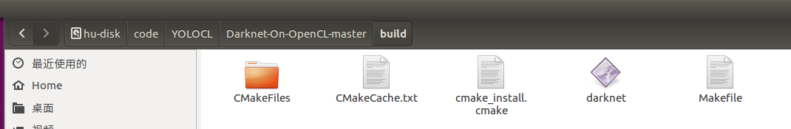

# Introduction

This project based on [Darknet-On-OpenCL](https://github.com/ganyc717/Darknet-On-OpenCL). I've accomplished the car detection function in video by using YOLO with OpenCL.

Darknet is an open source neural network framework written in C and CUDA.　It is fast, easy to install, and supports CPU and GPU computation. 

By using CUDA, the YOLO-V3-tiny can accomplish high FPS in object detection task, for more informations, please read [Original-YOLO.md](https://github.com/huuuuusy/YOLO-Learning-Notes/blob/master/Original-YOLO.md).

However, CUDA only supports Nvidia GPU. The orginal YOLO without using GPU will use more time in object detection. Thus, it is important to find a OpenCL version YOLO model to support other version GPUs. [Darknet-On-OpenCL](https://github.com/ganyc717/Darknet-On-OpenCL) provides this OpenCL version and I've tested it on my own PC.

# Build

First fork the source code from [Darknet-On-OpenCL](https://github.com/ganyc717/Darknet-On-OpenCL). Based on the guidance in this project, there are two dependancies: OpenCL and clBLAS. I will use my PC as an example.

The GPU in my PC is Nvidia GTX1070. Since I've installed CUDA9.0, the OpenCL is also installed in my PC with CUDA.

Use clinfo command to list the OpenCL information, it is clear that my Nvidia Driver is 390.48, and I've installed OpenCL 1.2 with CUDA.

Now in the Darknet-On-OpenCL folder, open the terminal and build the project.

    mkdir build && cd build
    cmake ../
    make

**Attention: Please make sure the make process has compiled the source code with OpenCL. Since the FindOpenCL.cmake file may not include all situations, thus the project may not find the OpenCL path in system.**

If the processing speed is very low, it may since you do not compile with OpenCL well. To avoid this problem, please add the OpenCL_INCLUDE_DIR and OpenCL_LIBRARIES in environment variables. Or just copy these related files in system folder.

In my PC, the OpenCL include folder is in /usr/local/cuda-9.0/include folder. Copy the CL folder to /usr/include folder.

Now copy the 4 lOpenCL libraries to /usr/lib folder.

After that, the project will find OpenCL_INCLUDE_DIR and OpenCL_LIBRARIES and combile with OpenCL.

# Test

Now the darknet.exe file will show in build folder. Copy it to the main directory and download the model weights in [darknet](https://pjreddie.com/darknet/yolo/).

Now the test command is the same as original YOLO. I will compare the results with the original YOLO.

||YOLO + CUDA9.0 (Original method)|YOLO + OpenCL1.2|
|:--:|:--:|:--:|
|GPU version|Nvidia GTX 1070|Nvidia GTX 1070|
|GPU platform|CUDA9.0|OpenCL1.2|
|YOLO Version|YOLO-V3-tiny|YOLO-V3-tiny|
|Image test|||
|Image test time|0.004s|0.02s|
|Video test|||
|Video test GPU memory use|||
|FPS|nearly 140~170|nearly 35~40|

It is clearly that YOLO + OpenCL is slower than YOLO + CUDA. Since the CUDA library is designed for Nvidia GPU and my GPU is Nvidia GTX 1070, this result can be explained.

