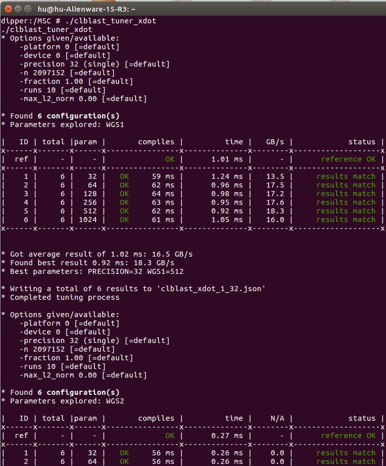

# Introduction

It is important to use GPU to accelerate the processing speed of YOLO. The [Original-YOLO.md](https://github.com/huuuuusy/YOLO-Learning-Notes/blob/master/Original-YOLO.md) includes how to use YOLO-V3 + CUDA9.0 + OpenCV3.40 to accomplish car detection. In this project, it uses [cuBLAS](https://docs.nvidia.com/cuda/cublas/index.html), an implementation of BLAS (Basic Linear Algebra Subprograms) on top of the NVIDIA®CUDA™ runtime. However, cuBLAS is mainly designed for NVIDIA GPU and can not be deployed in other versions.

The [YOLO-OpenCL.md](https://github.com/huuuuusy/YOLO-Learning-Notes/blob/master/YOLO-OpenCL.md) includes how to use YOLO based on OpenCL to accomplish car detection, and compare the processing speed (FPS) with the original YOLO network. This project uses OpenCL to replace CUDA and [clBLAS](https://github.com/clMathLibraries/clBLAS) to replace cuBLAS, which can be deployed in other PC GPUs. However, the clBLAS library depends on Python to accomplish compiling and does not suit the mobile GPUs (Reference: [Issue 285](https://github.com/clMathLibraries/clBLAS/issues/285)).

It is necessary to find a suitable BLAS library in Android platform to replace [clBLAS](https://github.com/clMathLibraries/clBLAS). [CLBlast](https://github.com/CNugteren/CLBlast) is a modern, lightweight, performant and tunable OpenCL BLAS library written in C++11. It is designed to leverage the full performance potential of a wide variety of OpenCL devices from different vendors, including desktop and laptop GPUs, embedded GPUs, and other accelerators. This note will introduce the cross compiling process for using CLBlast in Adreno 630.

# Cross Compiling Environment in Ubuntu 16.04

## Install NDK

Install NDK package in [official website](https://developer.android.com/ndk/downloads/), then set the environment variables:

	sudo gedit /etc/profile

Add the information:

	export NDK=/media/hu/hu-disk/package/android/ndk/android-ndk-r15c
    export SYSROOT=$NDK/platforms/android-18/arch-arm

***Remember changing the path and version information to suit your own platforms in each step***.

	source /etc/profile

## Build Toolchain Folder

Open a terminal in /media/hu/hu-disk/package/android/ndk/android-ndk-r15c/build/tools/:

	./make-standalone-toolchain.sh --platform=android-18 --install-dir=/media/hu/hu-disk/package/AndroidToolChain

--platform is the Android version，--install is the path of AndroidToolChain folder. 

## Set Cross Compiling Environment Veriables

Add following information in /etc/profile:

    export SYSROOT=/media/hu/hu-disk/package/AndroidToolChain/sysroot
    export NDK_CROSS=/media/hu/hu-disk/package/AndroidToolChain/bin
    export PATH=$PATH:$NDK:$NDK_CROSS
    export ANDROIDLIB=$SYSROOT/usr/lib
    export PATH=$PATH:$SYSROOT:/media/hu/hu-disk/package/AndroidToolChain
    export LD_LIBRARY_PATH=$ANDROIDLIB:$LD_LIBRARY_PATH

then run source /etc/profile in terminal.

## Copy Header File 

	cp /media/hu/hu-disk/package/AndroidToolChain/include/c++/4.9.x/arm-linux-androideabi/armv7-a/bits/* /media/hu/hu-disk/package/AndroidToolChain/include/c++/4.9.x/bits/
    
## Test

Now the cross compiling environment is well deployed. Now run a demo to test it.

Build a file named helloAndroid.cpp, copy the code in this file:

    #include <stdio.h>
    int main()
    {
        printf("hello Andriod \n");
        return 0;
    }
    
Run this command in terminal:

	arm-linux-androideabi-clang++ helloAndroid.cpp -o hello -pie -fPIE

Now use adb push to copy the folder in Android mobile phone (XIAOMI MI8) and test as this image shows:

## Set Anreno SDK for OpenCL

Download [Adreno SDK-OpenCL](https://developer.qualcomm.com/download/software).

Decompressing the file and copy the /inc/CL folder to /media/hu/hu-disk/package/AndroidToolChain/sysroot/usr/include.

Connect the mobile phone and run adb pull /system/vendor/lib/libOpenCL.so in terminal to copy the libOpenCL.so file.

Copy the libOpenCL.so in /media/hu/hu-disk/package/AndroidToolChain/sysroot/usr/lib.

## CLBlast Cross Compiling in Adreno 630

### Cross Compiling

Download the source code in [CLBlast](https://github.com/CNugteren/CLBlast).

Obey the [installation instruction](https://github.com/CNugteren/CLBlast/blob/master/doc/installation.md) for Android  Platform.

For deployment on Android, there are three options to consider.

First of all, you can use Google's recommended route of installing Android Studio with the NDK, and then use the JNI to interface to the CLBlast library. For this, we refer to the official Android Studio documentation and the online tutorials. I will try this method in futher step with YOLO source code.

Alternatively, you can cross-compile the library and the test/client/tuner executables directly. This is what I've selected in this stage. To do so, first finishing all the steps in Cross Compiling Environment in Ubuntu 16.04 correctly, then in the CLBlast source code folder, invoke CMake as follows:

	mkdir build && cd build
    
	cmake .. -DCMAKE_SYSTEM_NAME=Android  -DCMAKE_SYSTEM_VERSION=18 -DCMAKE_ANDROID_ARCH_ABI=armeabi-v7a -DCMAKE_ANDROID_NDK=/media/hu/hu-disk/package/android/ndk/android-ndk-r15c -DCMAKE_ANDROID_STL_TYPE=gnustl_static -DOPENCL_ROOT=/media/hu/hu-disk/package/AndroidToolChain/sysroot/usr/lib

	make

Finally, a third option is to use the Collective Knowledge framework in combination with the NDK, but there were some errors when I installed ck in my PC, thus I gave up. The commands for this method based on CLBlast developer's introduction is:

    sudo pip install ck
    ck pull repo:ck-math
    ck install package:lib-clblast-master-universal --target_os=android21-arm64

### Test on Adreno 630

Now connect the mobile phone (XIAOMI MI 8 with Adreno 630) and run:

	adb root 
	adb push /media/hu/hu-disk/code/YOLO-openCL/CLBlast-android/build /MSC

Select an executable file and test on Adreno 630:

I've mainly tested clblast_tuner_xdot, clblast_tuner_copy_fast and clblast_tuner_xgemm.

||clblast_tuner_xdot|clblast_tuner_copy_fast|clblast_tuner_xgemm|
|:--:|:--:|:--:|:--:|
|Command|./clblast_tuner_xdot|./clblast_tuner_copy_fast|./clblast_tuner_xgemm -m 256 -n 256 -k 256 -num_steps 4 -step 256|
|Result| |
|Json||||

