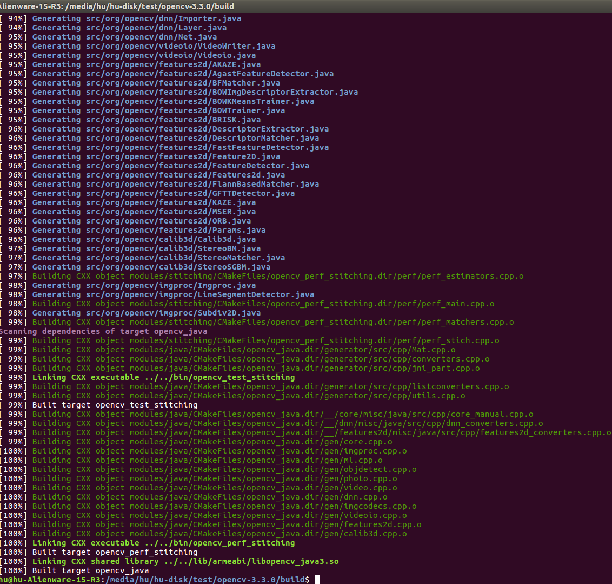
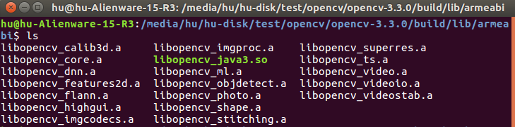
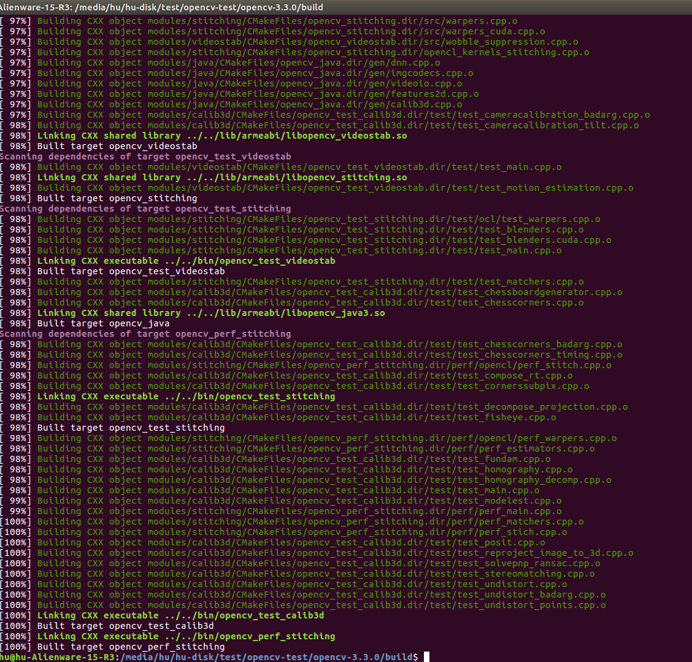
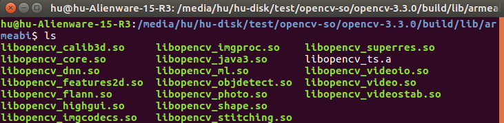

# Introduction

Since OpenCV is an important third party library for using YOLO, this blog introduces how to use cross compiling to generate opencv android library based on the source code.

**SDK Tools: tools_r25.2.5-linux**

**NDK Tools: android-ndk-r16b-linux-x86_64**

**OpenCV: 3.4.0**

Compiling OpenCV directly may failed like [#Issue 11185](https://github.com/opencv/opencv/issues/11185) since OpenCV doesn't support Android gradle builds at this moment.

According to [#Issue 8460](https://github.com/opencv/opencv/issues/8460), the correct process is as following:

### 1. Download SDK Tools

Based on [#Issue 8460](https://github.com/opencv/opencv/issues/8460), OpenCVDetectAndroidSDK.cmake doesn't detect an Android SDK after updating to the SDK Tools, Revision 25.3.0. Current solution is to downgrade SDK Tools to the latest available version prior 25.3.0: 25.2.5. Direct download links are:

https://dl.google.com/android/repository/tools_r25.2.5-linux.zip (265Mb)
https://dl.google.com/android/repository/tools_r25.2.5-macosx.zip (191Mb)
https://dl.google.com/android/repository/tools_r25.2.5-windows.zip (293Mb)

	$ mkdir sdk && cd sdk
    $ wget https://dl.google.com/android/repository/tools_r25.2.5-linux.zip && unzip tools_r25.2.5-linux.zip
    $ tools/android sdk

Select and install the following two packages:

**Android SDK Build-tools 27.0.3**

**Android 8.1.0 (API 27) -> SDK Platform 27**

### 2. Download OpenCV

This command will download the newest version of OpenCV (3.4.0):

	$ mkdir opencv && cd opencv
    $ git clone https://github.com/opencv/opencv.git

Now we need to install android-ant to avoid **ninja: error: unknown target 'opencv_engine'** error.

    $ cd ~/opencv/opencv
    $ wget https://gist.githubusercontent.com/ngriffiths/296e2fc16b8586705712d50bdfe746b0/raw/350a8cb6497bfe367dda75b7bb202d6c7ce09a72/always-use-ant__find_android.patch && git apply always-use-ant__find_android.patch

### 3. Download NDK

Download a NDK version from [here](https://developer.android.com/ndk/downloads/?hl=zh-cn), I've selected the r16b version. (Do not select the newest version, which may occur some errors)

### 4. Cross Compiling -- Static Library

In OpenCV main folder:

	$ mkdir build && cd build

Now verify the path of:

CMAKE_TOOLCHAIN_FILE = /media/hu/hu-disk/test/opencv/opencv/platforms/android/android.toolchain.cmake

ANDROID_NDK = /media/hu/hu-disk/test/opencv/android-ndk-r16b 

ANDROID_SDK = /media/hu/hu-disk/test/opencv/sdk

ANDROID_HOME = /media/hu/hu-disk/test/opencv/sdk

You should change the path to your own file.

**If you select the OpenCV 3.4.0, you can use the command below directly. If you select OpenCV 3.3.0, you should change:**

**1. Use the android.toolchain.cmake file in OpenCV 3.4.0 rather than the original file in OpenCV 3.3.0**

**2. Change the ABI information as below in build_sdk.py:**

**ABIs = [
    ABI("2", "armeabi-v7a", "arm-linux-androideabi-4.9", cmake_name="armeabi-v7a with NEON"),
    ABI("1", "armeabi",     "arm-linux-androideabi-4.9"),
    ABI("3", "arm64-v8a",   "aarch64-linux-android-4.9"),
    ABI("5", "x86_64",      "x86_64-4.9"),
    ABI("4", "x86",         "x86-4.9"),
    ABI("7", "mips64",      "mips64el-linux-android-4.9"),
    ABI("6", "mips",        "mipsel-linux-android-4.9")
]**

The cross compiling command is:

	$ cmake -DCMAKE_TOOLCHAIN_FILE=/media/hu/hu-disk/test/opencv/opencv/platforms/android/android.toolchain.cmake -DANDROID_NDK=/media/hu/hu-disk/test/opencv/android-ndk-r16b -DANDROID_SDK=/media/hu/hu-disk/test/opencv/sdk -DANDROID_HOME=/media/hu/hu-disk/test/opencv/sdk -DCMAKE_BUILD_TYPE=Release  -DANDROID_ABI=armeabi -DANDROID_NATIVE_API_LEVEL=27 ..
	$ make -j 8

The generate static libraries are as following:

### 5. Cross Compiling -- Dynamic Library

Add -DBUILD_SHARED_LIBS=1 in command to build the dynamic library:

	$ cmake -DCMAKE_TOOLCHAIN_FILE=/media/hu/hu-disk/test/opencv-so/opencv-3.3.0/platforms/android/android.toolchain.cmake -DANDROID_NDK=/media/hu/hu-disk/test/opencv/android-ndk-r16b -DANDROID_SDK=/media/hu/hu-disk/test/opencv/sdk -DBUILD_SHARED_LIBS=1 -DANDROID_HOME=/media/hu/hu-disk/test/opencv/sdk -DCMAKE_BUILD_TYPE=Release  -DANDROID_ABI=armeabi -DANDROID_NATIVE_API_LEVEL=27 ..

The generate static libraries are as following:

**The generated OpenCV dynamic libraries are uploaded in [OpenCV-Dynamic-Library](https://github.com/huuuuusy/YOLO-Learning-Notes/tree/master/OpenCV-Dynamic-Library) folder.**